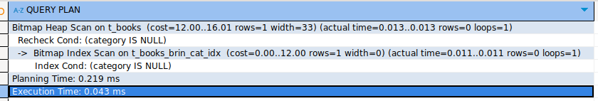
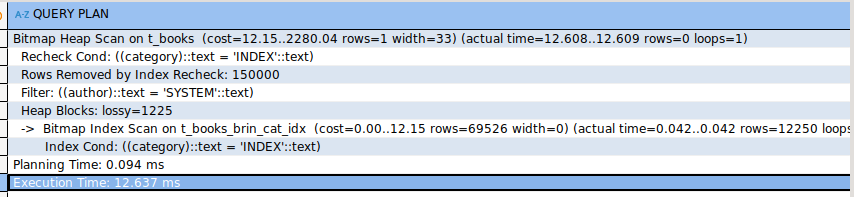
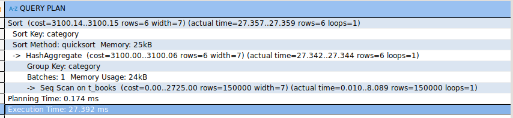
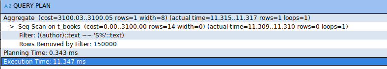
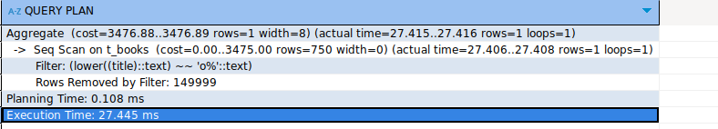
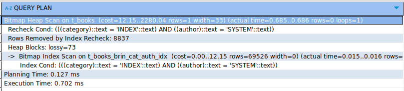

# Задание 1: BRIN индексы и bitmap-сканирование

1. Удалите старую базу данных, если есть:
   ```shell
   docker compose down
   ```

2. Поднимите базу данных из src/docker-compose.yml:
   ```shell
   docker compose down && docker compose up -d
   ```

3. Обновите статистику:
   ```sql
   ANALYZE t_books;
   ```

4. Создайте BRIN индекс по колонке category:
   ```sql
   CREATE INDEX t_books_brin_cat_idx ON t_books USING brin(category);
   ```

5. Найдите книги с NULL значением category:
   ```sql
   EXPLAIN ANALYZE
   SELECT * FROM t_books WHERE category IS NULL;
   ```
   
   *План выполнения:*
   
   
   
   *Объясните результат:*
   
   Из-за того, что мы использовали brin индекс, планировщик решил, использовать его для проверки диапозона строк где `category is null` таких не оказалось, следовательно, запрос очень быстро отработал

6. Создайте BRIN индекс по автору:
   ```sql
   CREATE INDEX t_books_brin_author_idx ON t_books USING brin(author);
   ```

7. Выполните поиск по категории и автору:
   ```sql
   EXPLAIN ANALYZE
   SELECT * FROM t_books 
   WHERE category = 'INDEX' AND author = 'SYSTEM';
   ```
   
   *План выполнения:*

   

   *Объясните результат (обратите внимание на bitmap scan):*
   
   Использовался индекс по `category` потому что он имеет более равномерное распределение (как мы видим мы просто генерим категории) из-за этого лучше его использовать, тк будет отсечено много блоков данных. `bitmap scan` здесь использовался, потому что планировщик решил тратить меньше на чтение данных, сканируя только те блоки, где может содержаться нужная строка

8. Получите список уникальных категорий:
   ```sql
   EXPLAIN ANALYZE
   SELECT DISTINCT category 
   FROM t_books 
   ORDER BY category;
   ```
   
   *План выполнения:*

   
   
   *Объясните результат:*

   Тк нет индексов мы видим `seq scan`, `hash aggregate` используется для того, чтобы выбрать уникальные значения

9. Подсчитайте книги, где автор начинается на 'S':
   ```sql
   EXPLAIN ANALYZE
   SELECT COUNT(*) 
   FROM t_books 
   WHERE author LIKE 'S%';
   ```
   
   *План выполнения:*

   
   
   *Объясните результат:*
   
   здесь используется текстовый паттерн, который `brin` индекс по `author` не может обработать, тк он индексирует не сами записи, а только агрегированные статистики

10. Создайте индекс для регистронезависимого поиска:
    ```sql
    CREATE INDEX t_books_lower_title_idx ON t_books(LOWER(title));
    ```

11. Подсчитайте книги, начинающиеся на 'O':
    ```sql
    EXPLAIN ANALYZE
    SELECT COUNT(*) 
    FROM t_books 
    WHERE LOWER(title) LIKE 'o%';
    ```
   
   *План выполнения:*

   
   
   *Объясните результат:*

   `B-tree` индекс не использовался, тк у нас записи только начинающиеся на `author` и планировщик это понял, поэтому прошелся `seq scan`

12. Удалите созданные индексы:
    ```sql
    DROP INDEX t_books_brin_cat_idx;
    DROP INDEX t_books_brin_author_idx;
    DROP INDEX t_books_lower_title_idx;
    ```

13. Создайте составной BRIN индекс:
    ```sql
    CREATE INDEX t_books_brin_cat_auth_idx ON t_books 
    USING brin(category, author);
    ```

14. Повторите запрос из шага 7:
    ```sql
    EXPLAIN ANALYZE
    SELECT * FROM t_books 
    WHERE category = 'INDEX' AND author = 'SYSTEM';
    ```
   
   *План выполнения:*

   

   *Объясните результат:*
   
   Использовался индекс которые мы создали, тк тут точное соответствие его специфике - то есть поиск по `category` и `author`