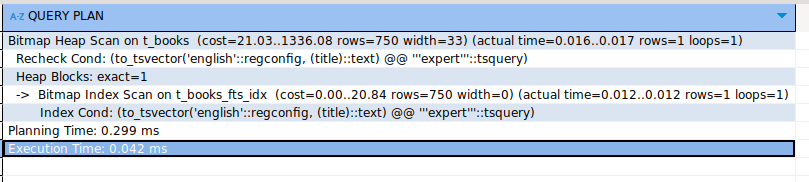
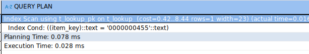
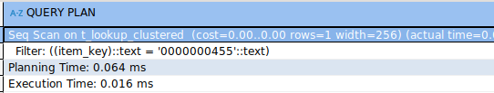
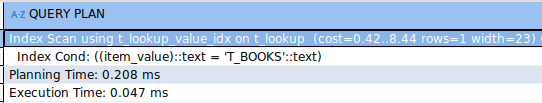
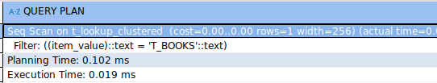

## Задание 2

1. Удалите старую базу данных, если есть:
    ```shell
    docker compose down
    ```

2. Поднимите базу данных из src/docker-compose.yml:
    ```shell
    docker compose down && docker compose up -d
    ```

3. Обновите статистику:
    ```sql
    ANALYZE t_books;
    ```

4. Создайте полнотекстовый индекс:
    ```sql
    CREATE INDEX t_books_fts_idx ON t_books 
    USING GIN (to_tsvector('english', title));
    ```

5. Найдите книги, содержащие слово 'expert':
    ```sql
    EXPLAIN ANALYZE
    SELECT * FROM t_books 
    WHERE to_tsvector('english', title) @@ to_tsquery('english', 'expert');
    ```
    
    *План выполнения:*

     
    
    *Объясните результат:*
    
    Отработал индекс, также мы видим, что используется `bitmap scan` чтобы проверить строки, которые подходят под условия при этом снизить количество операций чтения (перекладывается все на составление битовой карты)

6. Удалите индекс:
    ```sql
    DROP INDEX t_books_fts_idx;
    ```

7. Создайте таблицу lookup:
    ```sql
    CREATE TABLE t_lookup (
         item_key VARCHAR(10) NOT NULL,
         item_value VARCHAR(100)
    );
    ```

8. Добавьте первичный ключ:
    ```sql
    ALTER TABLE t_lookup 
    ADD CONSTRAINT t_lookup_pk PRIMARY KEY (item_key);
    ```

9. Заполните данными:
    ```sql
    INSERT INTO t_lookup 
    SELECT 
         LPAD(CAST(generate_series(1, 150000) AS TEXT), 10, '0'),
         'Value_' || generate_series(1, 150000);
    ```

10. Создайте кластеризованную таблицу:
     ```sql
     CREATE TABLE t_lookup_clustered (
          item_key VARCHAR(10) PRIMARY KEY,
          item_value VARCHAR(100)
     );
     ```

11. Заполните её теми же данными:
     ```sql
     INSERT INTO t_lookup_clustered 
     SELECT * FROM t_lookup;
     
     CLUSTER t_lookup_clustered USING t_lookup_clustered_pkey;
     ```

12. Обновите статистику:
     ```sql
     ANALYZE t_lookup;
     ANALYZE t_lookup_clustered;
     ```

13. Выполните поиск по ключу в обычной таблице:
     ```sql
     EXPLAIN ANALYZE
     SELECT * FROM t_lookup WHERE item_key = '0000000455';
     ```
     
     *План выполнения:*

     
     
     *Объясните результат:*
     
     Использование индекса, который мы создали и по которому перестроили таблицу, в целом очевидно почему так, потому что `item_key` обладает высокой селективностью

14. Выполните поиск по ключу в кластеризованной таблице:
     ```sql
     EXPLAIN ANALYZE
     SELECT * FROM t_lookup_clustered WHERE item_key = '0000000455';
     ```
     
     *План выполнения:*

     
     
     *Объясните результат:*
     
     Использование `seq scan`, но при этом времени затраченног она выполнение и планирование меньше. PostgreSQL может эффективно считывать все необходимые записи из соседних блоков данных тк они находятся рядом на диске, следовательно, меньше нагрузки на операции `I/O`

15. Создайте индекс по значению для обычной таблицы:
     ```sql
     CREATE INDEX t_lookup_value_idx ON t_lookup(item_value);
     ```

16. Создайте индекс по значению для кластеризованной таблицы:
     ```sql
     CREATE INDEX t_lookup_clustered_value_idx 
     ON t_lookup_clustered(item_value);
     ```

17. Выполните поиск по значению в обычной таблице:
     ```sql
     EXPLAIN ANALYZE
     SELECT * FROM t_lookup WHERE item_value = 'T_BOOKS';
     ```
     
     *План выполнения:*

     
     
     *Объясните результат:*
     
     Использование индекса по `item_value`

18. Выполните поиск по значению в кластеризованной таблице:
     ```sql
     EXPLAIN ANALYZE
     SELECT * FROM t_lookup_clustered WHERE item_value = 'T_BOOKS';
     ```
     
     *План выполнения:*

     
     
     *Объясните результат:*

     Использование `seq scan` но при этом если заметить, время на выполнение и планирование намного меньше, мне кажется из-за того, что планировщик перестроился под этот индекс и понял, что для такой таблицы будет легче сразу ее от сканировать (тк не слишком много данных 150к для современных бд, не очень много, обычно видел намного больше таблицы, например, если таблица была бы под 10-20 терабайт, то да, скорее всего заюзался бы индекс, а так нет)


19. Сравните производительность поиска по значению в обычной и кластеризованной таблицах:
     
     *Сравнение:*

     В обычной таблице поиск с использованием индекса может быть более эффективным, но не как здесь. Однако в кластеризованной таблице, где данные физически сгруппированы, `seq scan` может быть быстрее, так как строки с нужным значением уже расположены рядом, что снижает количество операций ввода-вывода и ускоряет выполнение запроса.

     По сути тут таблицы весят почти ничего, 12-15мб - это ну слишком мало, `seq scan` реально может быстрее просто отрабатывать из-за особенностей работы с индексами, тк могут происходить случайные чтения

     Другой разговор был бы, если таблица была бы ну хотя бы 500мб, а лучше гб 10, чтобы данные в оперативу точно не вмещались и тогда, да индекс бы помог, а так получается `seq scan` просто все в оперативку тащит и из-за этого видим для него хорошие результаты