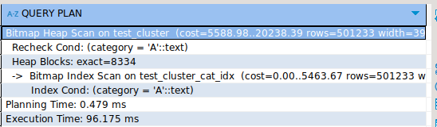
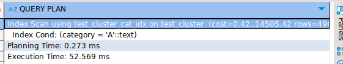

## Задание 3

1. Создайте таблицу с большим количеством данных:
    ```sql
    CREATE TABLE test_cluster AS 
    SELECT 
        generate_series(1,1000000) as id,
        CASE WHEN random() < 0.5 THEN 'A' ELSE 'B' END as category,
        md5(random()::text) as data;
    ```

2. Создайте индекс:
    ```sql
    CREATE INDEX test_cluster_cat_idx ON test_cluster(category);
    ```

3. Измерьте производительность до кластеризации:
    ```sql
    EXPLAIN ANALYZE
    SELECT * FROM test_cluster WHERE category = 'A';
    ```
    
    *План выполнения:*

    
    
    *Объясните результат:*

    При размере в 1 миллион строк `bitmap scan` часто оказывается быстрее, чем `seq scan`, так как он позволяет избежать полного чтения всех строк и сосредоточиться только на нужных запросу страницах

4. Выполните кластеризацию:
    ```sql
    CLUSTER test_cluster USING test_cluster_cat_idx;
    ```
    
    *Результат:*
    
    Не увидел, что нужно скринить этот этап, но выполнение этого запроса у меня выполнялось около 2 сек, тк шло перестраивание по индексу

5. Измерьте производительность после кластеризации:
    ```sql
    EXPLAIN ANALYZE
    SELECT * FROM test_cluster WHERE category = 'A';
    ```
    
    *План выполнения:*

    
    
    *Объясните результат:*
    
    Что я и говорил в `task2.md` данных стало побольше, следотельно, началось использование индекса из-за того, что под этот запрос специально индекс подстраивался

6. Сравните производительность до и после кластеризации:
    
    *Сравнение:*
    
    Видно что время на кластеризации меньше, причем в 2 раза по обоим параметрам `planning time` и `execution time` это сведетельствует о том, что у нас происходит перестройка таблицы под индекс, который мы потом используем для запроса `select * from ... where category = 'A'`